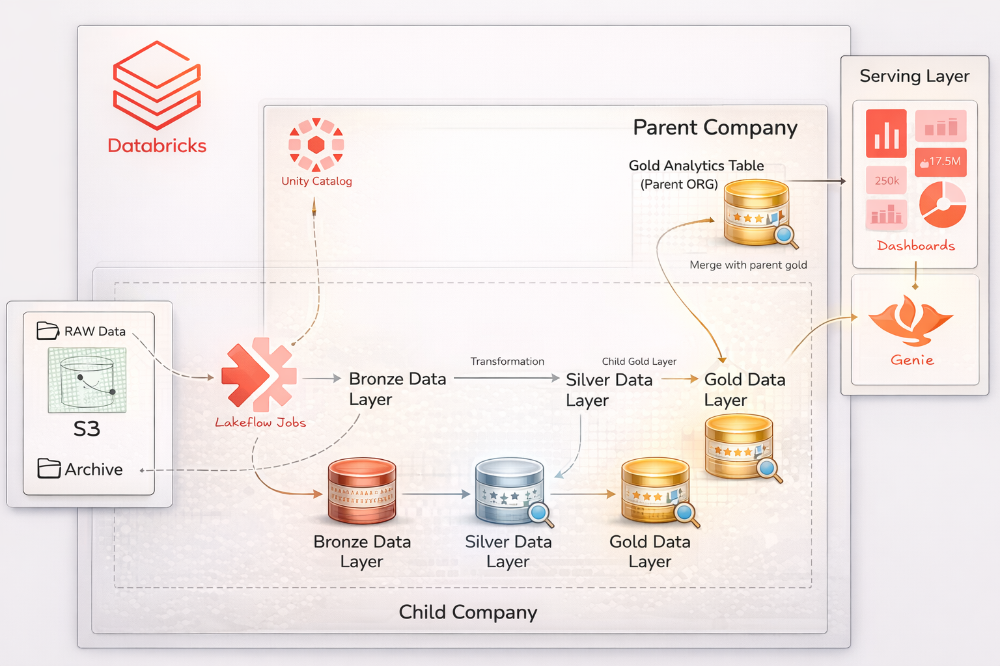
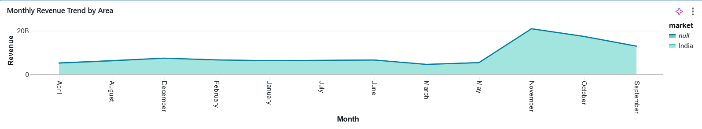
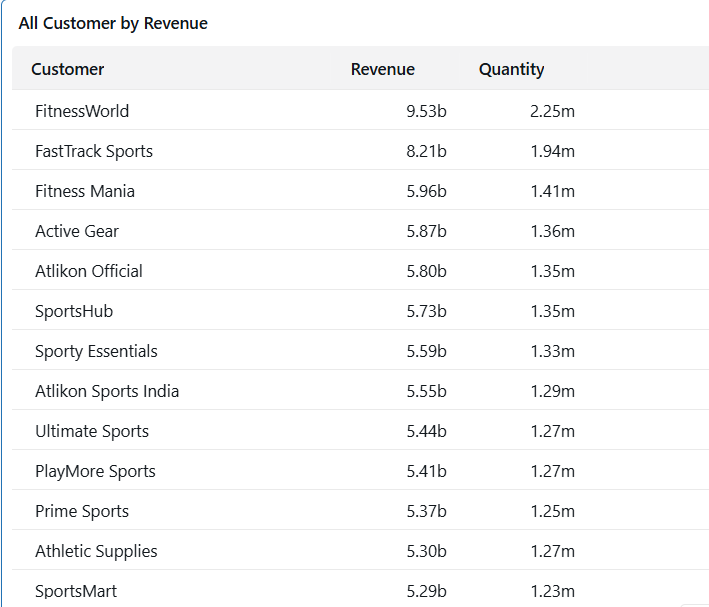
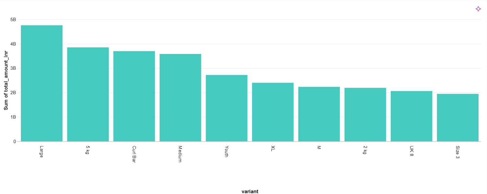
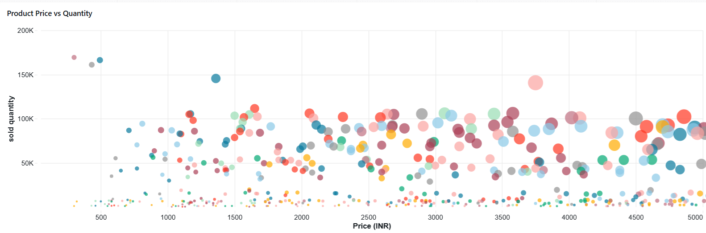

### Once upon a time...
## The Integration Challenge: Atlion x SportsBar

When **Atlion** acquired **SportsBar**, the goal was market dominance and the atmosphere was one of pure excitement and strategic ambition. However, the celebration was short-lived as engineering teams discovered a critical roadblock: the two companies' datasets were fundamentally **incompatible**.

Because the data schemas and structures do not align, we are currently unable to perform collective operations or extract unified business insights. This repository serves as the central hub for the migration and synchronization project required to bridge the gap between these two digital ecosystems.

👨‍💼 : Peter Pandey ( Manager )

💻 : Sonu Smith ( Data Engineer )

#### 🎙️ The Boardroom Conversation

> 👨‍💼: "This is a disaster. The systems don't talk to each other and we can't see our total revenue because the data formats are a mess!"
>
> 💻: "The schemas are totally different. A quick fix will just break tomorrow; we need a permanent, automated bridge to harmonize these datasets."
>
> 👨‍💼: "Agreed. Build a long-term pipeline that modifies and cleans the data before it hits the Gold layer. We need a 'Source of Truth' that actually works."
>
> 💻: "I'll implement a Medallion Architecture. We’ll handle the schema mapping in Silver and use Delta Merges to ensure the Gold layer is always accurate."
>
> 👨‍💼: "The stakeholders are already on the waiting list and the pressure is on. Can we get this done before the next board meeting?"
>
> 💻: "The architecture is ready. I’ll have the automated flow and the unified dashboard live ahead of schedule. Let's get to work."


# 🚀 OmniLink: Cross-Platform Retail Data Harmonization


> **An End-to-End Data Engineering solution harmonizing conflicting schemas from a corporate acquisition into a unified Delta Lakehouse.**

---

## 📖 Project Overview

**The Business Scenario:**
A Parent Company has recently acquired a smaller "Child Company." The Parent Company needs to integrate the Child Company's sales and customer data into their central Data Warehouse to generate global insights.

**The Challenge:**
The Child Company's data, stored in **AWS S3**, is incompatible with the Parent Company's standards:
* **Schema Mismatch:** Different column names (`id` vs `customer_code`).
* **Data Quality Issues:** Null values in critical fields (e.g., `City`), inconsistent casing in names.
* **Scalability:** Need a pipeline that handles initial history load AND future incremental updates without duplicates.

**The Solution:**
I engineered a scalable ETL pipeline using **Databricks (PySpark)** and **Delta Lake** that ingests raw data, harmonizes the schema, enriches missing information using lookup tables, and merges the result into the Parent's Gold layer using **Upsert (SCD Type 1)** logic.

---

## 🏗️ Technical Architecture


*(Note: This is the workflow I designed. Data flows from AWS S3 -> Bronze (Raw) -> Silver (Cleaned/Enriched) -> Gold (Aggregated/Modeled) -> Dashboard)*

### **The Medallion Architecture Implementation**

| Layer | Type | Responsibility | Key Tech Used |
| :--- | :--- | :--- | :--- |
| **Bronze** | Raw | Ingests CSV files from **AWS S3** with zero transformation. Captures file metadata (`_metadata.file_name`). | `spark.read.csv`, Wildcard Paths |
| **Silver** | Cleaned | **Schema Harmonization:** Renames columns to match Parent schema.<br>**Data Patching:** Fills `NULL` cities using a manual dictionary lookup.<br>**Standardization:** Applies Title Casing (`initcap`) to names. | `join`, `coalesce`, `withColumn`, `initcap` |
| **Gold** | Curated | **Upsert Logic:** Merges data into the Master Dimension tables. Updates existing records and inserts new ones. | `DeltaTable.merge`, `whenMatchedUpdate`, `whenNotMatchedInsert` |

---

## Data Pipeline Stages (Medallion Architecture)

I implemented a three-tier **Medallion Architecture** to transform raw, disparate data into high-value business insights.


### 📥 1. Bronze Layer (Raw Ingestion)
The entry point for all raw data arriving from AWS S3.
* **Process:** Performed direct ingestion of CSV files using Spark's CSV reader.
* **Auditability:** Added a `read_timestamp` and extracted `_metadata.file_name` to maintain a clear audit trail of the data source for every record.
* **Storage:** Data is stored in its original format to allow for re-processing if business logic changes.

### 🧹 2. Silver Layer (Cleaned & Harmonized)
This layer acts as the "Translation Layer" where the child company's data is aligned with the parent company's standards.
* **Schema Harmonization:** Renamed inconsistent columns (e.g., `cust_id` to `customer_code`) to ensure a unified schema.
* **Data Quality (DQ):** * Applied `F.initcap()` to standardize customer names into Title Case.
    * Integrated a business lookup table to patch missing `City` information based on `customer_id`.
* **Feature Engineering:** Created a consolidated `customer` attribute by concatenating `CustomerName-City` for better reporting granularity.

### 🏆 3. Gold Layer (Curated & Modeled)
The final "Source of Truth" optimized for BI and analytics.
* **Delta Merge (Upsert):** Leveraged Delta Lake's `MERGE` capability to perform **SCD Type 1 updates**. This ensures that existing records are updated with the latest price/info while new records are inserted.
* **Data Integrity:** Guaranteed zero duplicates in dimension tables, providing a reliable foundation for the executive dashboards.
* **CDF Enabled:** Change Data Feed was enabled to allow downstream systems to consume only the "changes" from each run.

---
---

## 🛠️ Tech Stack

* **Cloud Storage:** AWS S3 (Source Data)
* **Compute:** Databricks (Standard Cluster, Runtime 14.3 LTS)
* **Engine:** Apache Spark (PySpark)
* **Storage Format:** Delta Lake (for ACID Transactions & Time Travel)
* **Catalog:** Unity Catalog (3-Level Namespace: `catalog.schema.table`)
* **Orchestration:** Databricks Workflows
* **Visualization:** PowerBI / Databricks SQL Dashboards

---

## 💻 Key Engineering Features

### 1. Dynamic Ingestion via Widgets
Instead of hardcoding paths, I utilized Databricks Widgets to parameterize the notebook, making it reusable for different datasets (e.g., `Sales`, `Customers`).

```python
# Setup dynamic widgets for pipeline flexibility
dbutils.widgets.text("data_source", "customers", "Data Source")
data_source = dbutils.widgets.get("data_source")

base_path = f's3://sportsbar-child/{data_source}/*.csv'
```

### 2. Intelligent Data Patching (The "City Fix")
Business teams provided a manual list of corrections for missing cities. I implemented a robust lookup mechanism to patch these holes during transformation.
```python
# Fixing Null cities using a dictionary lookup
df_silver = df_silver.join(df_fix, "customer_id", "left") \
    .withColumn("city", F.coalesce("city", "fixed_city")) \
    .drop("fixed_city")
```

### 3. Idempotent Writes (Delta Upsert)
To prevent duplicates when re-running the pipeline, I replaced standard append modes with Delta Lake's MERGE operation.
```python
# SCD Type 1 Upsert: Update if exists, Insert if new
delta_table.alias("target").merge(
    source=df_child_customers.alias("source"),
    condition="target.customer_code = source.customer_code"
).whenMatchedUpdateAll().whenNotMatchedInsertAll().execute()
```


## 📊 Dashboard & Insights
### 🔍 Sales Insight


### 🔍 Product Insight


### 🔍 Customer Insight



## 🏃 Getting Started: How to Run This Project

Follow these steps to deploy the pipeline in your own Databricks environment.

### 📋 Prerequisites
* An active **Databricks Workspace** (Community or Enterprise edition).
* Access to an **AWS S3 Bucket** or **Databricks File System (DBFS)** for data storage.
* A Databricks Cluster running **Runtime 14.3 LTS** or higher.

---

### 🛠️ Installation Steps

#### 1️⃣ Clone the Repository
Open your terminal (or use the Databricks Repos feature) and run:
```bash
git clone [https://github.com/yourusername/unified-commerce-pipeline.git](https://github.com/yourusername/unified-commerce-pipeline.git)
```

#### 1️⃣📤 Upload Source Data
To simulate the production environment, you need to place the source files in a location accessible by Spark:
* **AWS S3:** Upload the CSV files located in the `/data` folder to your S3 bucket (e.g., `s3://your-bucket-name/raw-zone/`).
* **Databricks DBFS:** Alternatively, use the Databricks UI to upload files directly to `dbfs:/FileStore/tables/metadata_input/`.

#### 3️⃣ 📂 Import Notebooks
Bring the logic into your Databricks Workspace:
1.  Navigate to your **Workspace** folder.
2.  Select **Import** > **File**.
3.  Upload the `.py` files (or the `.dbc` archive) found in the `/notebooks` directory of this repository.

#### 4️⃣ ⚙️ Configure Environment Widgets
Each notebook is parameterized using **Databricks Widgets** to ensure portability across different environments. Before running, set the following parameters at the top of the notebook UI:
* `storage_path`: The S3 or DBFS path where your raw data resides.
* `catalog_name`: Your Unity Catalog destination (e.g., `main`).
* `schema_name`: The target schema for the Medallion layers (e.g., `retail_acquisition`).

#### 5️⃣ 🔄 Run the Pipeline
Execute the notebooks in sequence to trigger the **End-to-End ETL** flow:

| Order | Notebook Name | Action |
| :--- | :--- | :--- |
| **Step 1** | `01_Ingest_Bronze` | 📥 Reads CSV from S3 and writes to Raw Delta tables. |
| **Step 2** | `02_Transform_Silver` | 🧹 Schema mapping, `initcap` formatting, and city-patching. |
| **Step 3** | `03_Load_Gold` | 🥇 Executes `MERGE` (Upsert) logic for final dimension tables. |

---


### 👋 Connect with me:

<div align=center>

[](https://www.linkedin.com/in/deepakyadav32656/)
[](https://github.com/Deep-32656)
<a href="mailto:deepakyadav32656@gmail.com" target="_blank"></a>
[](https://x.com/Deepu_Yadv_)

</div>

<br>

---
